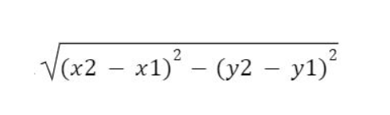

# DISTANCE-BETWEEN-TWO-POINTS

## AIM:
To write a python program to find the distance two 2 points
## ALGORITHM:
### Step 1: 
start the program
### Step 2: 
import math
### Step 3: 
Substitute the values in the distance formula  
### Step 4: 
print the value of distance
### Step 5: 
run the program.

### PROGRAM:
```
import math
d2=[10,6]
d1=[4,2]
distance=math.sqrt(((d2[0]-d1[0])**2)+((d2[1]-d1[1])**2))
print("{:.2f}".format(distance))
```
  


### OUTPUT:


### RESULT:
Thus the distsnce between the two points has been calculated.